## 📊 Stats

  
  

## 👋 Hello

I'm **Kaio Conde**, a **software developer with nearly 10 years of experience**, strongly focused on **backend development**, while maintaining solid expertise in **front-end technologies**.

Throughout my career, I've worked on a wide range of web projects — from small systems to complex, scalable applications — always prioritizing **clean code**, **performance**, and **maintainability**.

My core expertise is **PHP and its ecosystem**, but I’m comfortable working across the stack whenever the project requires it.

---

## 🚀 Professional Focus

- 🧠 Backend-first mindset with full-stack capabilities  
- ⚙️ API design, system architecture & performance  
- 🔐 Security-aware and server-authoritative approaches  
- 🧩 Clean Architecture & best practices  
- 🛠 Long-term maintainable solutions  

---

## 🌐 Social & Links

- 🌍 Website: **https://kaioconde.dev**
